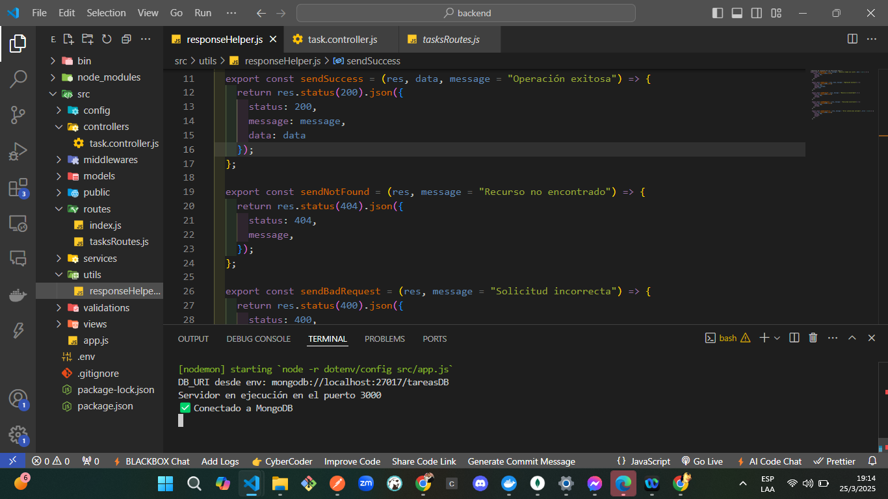
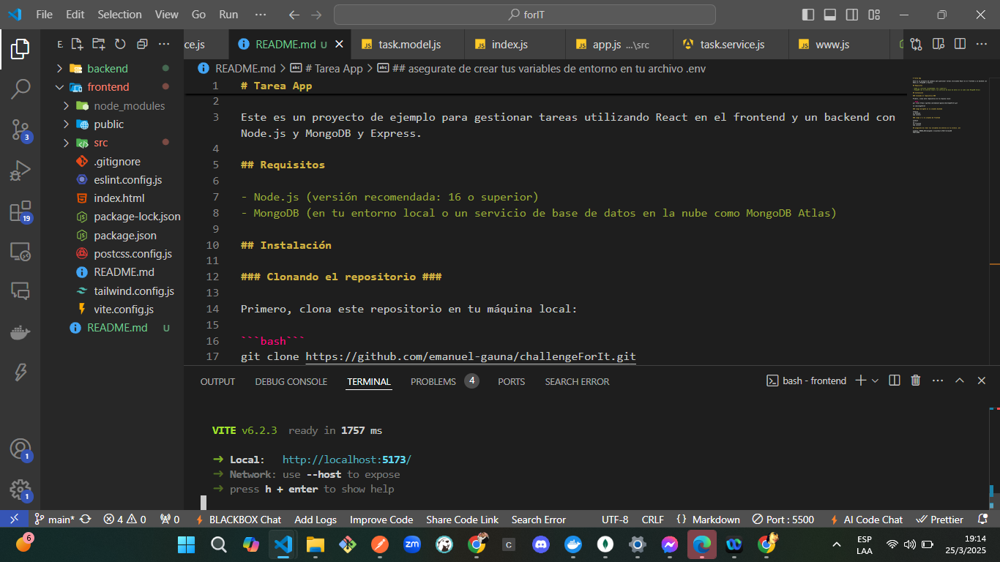
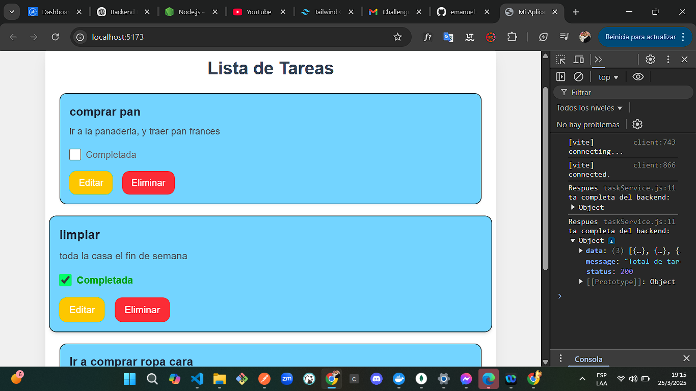
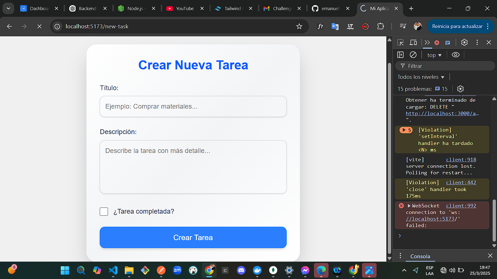
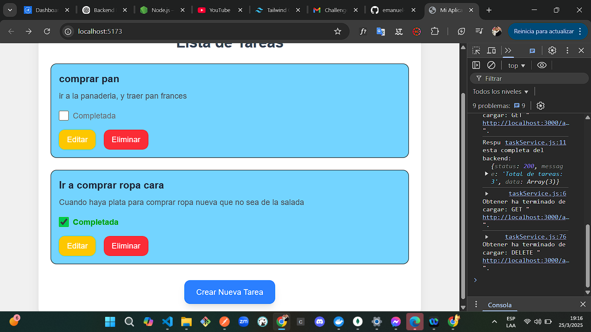

# Tarea App

Este es un proyecto de ejemplo para gestionar tareas utilizando React en el frontend y un backend con Node.js y MongoDB y Express.

## Requisitos

- Node.js (versión recomendada: 16 o superior)
- MongoDB (en tu entorno local o un servicio de base de datos en la nube como MongoDB Atlas)

## Instalación

### Clonando el repositorio ###

Primero, clona este repositorio en tu máquina local:

```bash```
git clone https://github.com/emanuel-gauna/challengeForIt.git

cd challengeForIt

### luego dirigete al la carpeta backend

´´´bash
cd backend
npm install

### luego ir a la carpeta de frontend

´´´bash 
cd ..
cd frontend
npm install

## asegurate de crear tus variables de entorno en tu archivo .env

ejemplo: MONGO_URI=mongodb://localhost:27017/tareasDB
PORT=3000

## capturas de pantallas

### 2. **Capturas de Pantalla (Screenshots)**

Para agregar capturas de pantalla de la aplicación en funcionamiento, puedes seguir esta estructura:

```markdown
## Capturas de Pantalla

A continuación se muestran algunas capturas de pantalla de la aplicación en funcionamiento:

### formato de carpetas  backend



### formato de carpetas frontend



### todas las tareas


add
### crear nueva tarea



### Editar tarea


## Eliminar tarea


